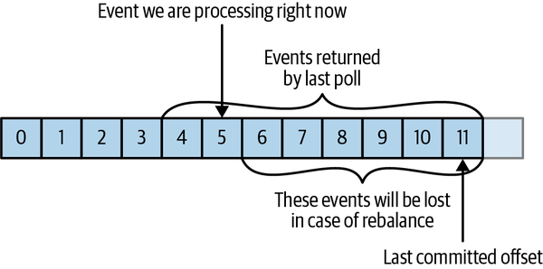

# Chapter 4: Kafka Consumers: Reading Data from Kafka

## [Back to README](../README.md) | [Next Chapter: Managing Apache Kafka Programmatically](./05-managing-kafka.md)

---

## Table of Contents

- [Kafka Consumer Concepts](#kafka-consumer-concepts)
- [Creating a Kafka Consumer](#creating-a-kafka-consumer)
- [Subscribing to Topics](#subscribing-to-topics)
- [The Poll Loop](#the-poll-loop)
- [Configuring Consumers](#configuring-consumers)
- [Commits and Offsets](#commits-and-offsets)
- [Rebalance Listeners](#rebalance-listeners)
- [Consuming Records with Specific Offsets](#consuming-records-with-specific-offsets)
- [But How Do We Exit](#but-how-do-we-exit)
- [Deserializers](#deserializers)
- [Standalone Consumer](#standalone-consumer)
- [Summary](#summary)

---

## Kafka Consumer Concepts

Applications that need to read data from Kafka use a `KafkaConsumer` to subscribe to Kafka topics and receive messages from these topics. Reading data from Kafka is a bit different than reading data from other messaging systems, and there are a few unique concepts and ideas involved.

### Consumers and Consumer Groups

Kafka consumers are typically part of a **consumer group**. When multiple consumers are subscribed to a topic and belong to the same consumer group, each consumer in the group will receive messages from a different subset of the partitions in the topic.

#### Figure 4-1: One consumer group with four partitions


#### Figure 4-2: Four partitions split to two consumers in a group


#### Figure 4-3: Four consumers in a group with one partition each


#### Figure 4-4: More consumers in a group than partitions means idle consumers


The main way we scale data consumption from a Kafka topic is by adding more consumers to a consumer group. To summarize, you create a new consumer group for each application that needs all the messages from one or more topics. You add consumers to an existing consumer group to scale the reading and processing of messages.

#### Figure 4-5: Adding a new consumer group, both groups receive all messages


### Consumer Groups and Partition Rebalance

Moving partition ownership from one consumer to another is called a **rebalance**. Rebalances are important because they provide the consumer group with high availability and scalability, but they can also be undesirable.

#### Eager Rebalances

During an eager rebalance, all consumers stop consuming, give up their ownership of all partitions, rejoin the consumer group, and get a brand-new partition assignment.

#### Figure 4-6: Eager rebalance revokes all partitions, pauses consumption, and reassigns them


#### Cooperative Rebalances

Cooperative rebalances (also called incremental rebalances) typically involve reassigning only a small subset of the partitions from one consumer to another, and allowing consumers to continue processing records from all the partitions that are not reassigned.

#### Figure 4-7: Cooperative rebalance only pauses consumption for the subset of partitions that will be reassigned


Consumers maintain membership in a consumer group and ownership of the partitions assigned to them by sending **heartbeats** to a Kafka broker designated as the **group coordinator**.

### Static Group Membership

By default, the identity of a consumer as a member of its consumer group is transient. All this is true unless you configure a consumer with a unique `group.instance.id`, which makes the consumer a **static** member of the group. When a consumer shuts down, it does not automatically leave the group—it remains a member of the group until its session times out.

---

## Creating a Kafka Consumer

The first step to start consuming records is to create a `KafkaConsumer` instance:

```java
Properties props = new Properties();
props.put("bootstrap.servers", "broker1:9092,broker2:9092");
props.put("group.id", "CountryCounter");
props.put("key.deserializer", "org.apache.kafka.common.serialization.StringDeserializer");
props.put("value.deserializer", "org.apache.kafka.common.serialization.StringDeserializer");
KafkaConsumer<String, String> consumer = new KafkaConsumer<>(props);
```

---

## Subscribing to Topics

Once we create a consumer, the next step is to subscribe to one or more topics:

```java
consumer.subscribe(Collections.singletonList("customerCountries"));
```

It is also possible to call `subscribe` with a regular expression:

```java
consumer.subscribe(Pattern.compile("test.*"));
```

---

## The Poll Loop

At the heart of the Consumer API is a simple loop for polling the server for more data:

```java
Duration timeout = Duration.ofMillis(100);
while (true) {
    ConsumerRecords<String, String> records = consumer.poll(timeout);
    for (ConsumerRecord<String, String> record : records) {
        System.out.printf("topic = %s, partition = %d, offset = %d\n",
            record.topic(), record.partition(), record.offset());
    }
}
```

The `poll()` method returns records written to Kafka that consumers in our group have not read yet. Consumers are usually long-running applications that continuously poll Kafka for more data.

### Thread Safety

**One consumer per thread is the rule.** You can't have multiple consumers that belong to the same group in one thread, and you can't have multiple threads safely use the same consumer.

---

## Configuring Consumers

Key configuration properties include:

### fetch.min.bytes

This property allows a consumer to specify the minimum amount of data that it wants to receive from the broker when fetching records (default: 1 byte).

### fetch.max.wait.ms

Controls how long to wait. By default, Kafka will wait up to 500 ms.

### session.timeout.ms and heartbeat.interval.ms

The amount of time a consumer can be out of contact with the brokers while still considered alive defaults to 10 seconds. `heartbeat.interval.ms` controls how frequently the Kafka consumer will send a heartbeat to the group coordinator.

### max.poll.interval.ms

This property lets you set the length of time during which the consumer can go without polling before it is considered dead. Default value is 5 minutes.

### auto.offset.reset

This property controls the behavior of the consumer when it starts reading a partition for which it doesn't have a committed offset. Options are "latest" (default), "earliest", or "none".

### partition.assignment.strategy

Determines how partitions are assigned to consumers. Options include "Range", "RoundRobin", "Sticky", and "CooperativeSticky".

---

## Commits and Offsets

Whenever we call `poll()`, it returns records that consumers in our group have not read yet. One of Kafka's unique characteristics is that it allows consumers to use Kafka to track their position (offset) in each partition.

#### Figure 4-8: Reprocessed messages


#### Figure 4-9: Missed messages between offsets


### Automatic Commit

If you configure `enable.auto.commit=true`, then every five seconds the consumer will commit the latest offset that your client received from `poll()`.

### Synchronous Commit

```java
try {
    consumer.commitSync();
} catch (CommitFailedException e) {
    log.error("commit failed", e);
}
```

### Asynchronous Commit

```java
consumer.commitAsync(new OffsetCommitCallback() {
    public void onComplete(Map<TopicPartition, OffsetAndMetadata> offsets, Exception e) {
        if (e != null)
            log.error("Commit failed for offsets {}", offsets, e);
    }
});
```

---

## Rebalance Listeners

The Consumer API allows you to run your own code when partitions are added or removed from the consumer by passing a `ConsumerRebalanceListener` when calling the `subscribe()` method.

```java
private class HandleRebalance implements ConsumerRebalanceListener {
    public void onPartitionsAssigned(Collection<TopicPartition> partitions) {
        // Prepare or load any state needed for the partition
    }
    public void onPartitionsRevoked(Collection<TopicPartition> partitions) {
        consumer.commitSync(currentOffsets);
    }
}

consumer.subscribe(topics, new HandleRebalance());
```

---

## Consuming Records with Specific Offsets

Kafka offers methods to start consuming at different offsets:
- `seekToBeginning(Collection<TopicPartition> tp)` - Read from the beginning
- `seekToEnd(Collection<TopicPartition> tp)` - Skip to the end
- `seek(TopicPartition partition, long offset)` - Seek to a specific offset

---

## But How Do We Exit

To exit the poll loop cleanly, use `consumer.wakeup()` from another thread:

```java
Runtime.getRuntime().addShutdownHook(new Thread() {
    public void run() {
        System.out.println("Starting exit...");
        consumer.wakeup();
        try {
            mainThread.join();
        } catch (InterruptedException e) {
            e.printStackTrace();
        }
    }
});

try {
    while (true) {
        ConsumerRecords<String, String> records = consumer.poll(timeout);
        // process records
    }
} catch (WakeupException e) {
    // ignore for shutdown
} finally {
    consumer.close();
}
```

---

## Deserializers

Similar to producers, consumers require deserializers to convert byte arrays received from Kafka into Java objects.

### Custom Deserializers

Implementing a custom deserializer for a `Customer` class:

```java
public class CustomerDeserializer implements Deserializer<Customer> {
    @Override
    public void configure(Map<String, ?> configs, boolean isKey) {
    }
    
    @Override
    public Customer deserialize(String topic, byte[] data) {
        // Deserialize bytes to Customer object
        return new Customer(id, name);
    }
    
    @Override
    public void close() {
    }
}
```

### Using Avro Deserialization

```java
Properties props = new Properties();
props.put("bootstrap.servers", "broker1:9092,broker2:9092");
props.put("group.id", "CountryCounter");
props.put("key.deserializer", "org.apache.kafka.common.serialization.StringDeserializer");
props.put("value.deserializer", "io.confluent.kafka.serializers.KafkaAvroDeserializer");
props.put("schema.registry.url", schemaUrl);

KafkaConsumer<String, Customer> consumer = new KafkaConsumer<>(props);
```

---

## Standalone Consumer

Sometimes you want to read data from a specific partition instead of using a consumer group. In this case, you don't subscribe to a topic—instead, you assign yourself a few partitions:

```java
List<PartitionInfo> partitionInfos = consumer.partitionsFor("topic");
if (partitionInfos != null) {
    for (PartitionInfo partition : partitionInfos)
        partitions.add(new TopicPartition(partition.topic(), partition.partition()));
    consumer.assign(partitions);
}
```

---

## Summary

We started this chapter with an in-depth explanation of Kafka's consumer groups and the way they allow multiple consumers to share the work of reading events from topics. We followed the theoretical discussion with a practical example of a consumer subscribing to a topic and continuously reading events. We then looked into the most important consumer configuration parameters and how they affect consumer behavior. We dedicated a large part of the chapter to discussing offsets and how consumers keep track of them. We then discussed rebalances, handling rebalances with listeners, and closing the consumer. We concluded by discussing the deserializers used by consumers to turn bytes stored in Kafka into Java objects that the applications can process.

---

[Chapter 3: Kafka Producers](./03-kafka-producers.md) | [Back to README](../README.md) | [Chapter 5: Managing Apache Kafka Programmatically](./05-managing-kafka.md)
1
