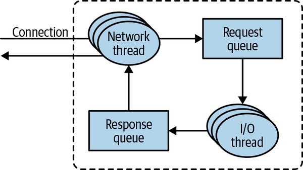
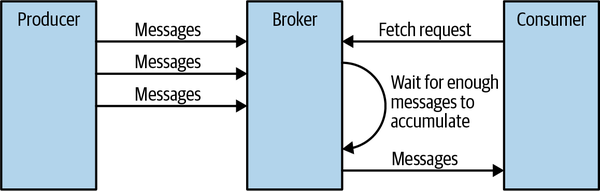
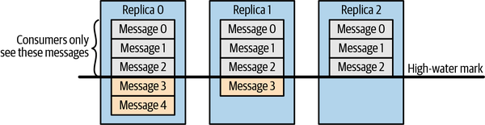
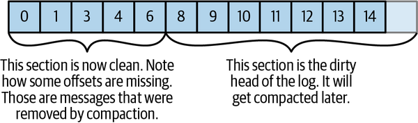

# Chapter 6. Kafka Internals

It is not strictly necessary to understand Kafka’s internals in order to run Kafka in production or write applications that use it. However, knowing how Kafka works does provide context when troubleshooting or trying to understand why Kafka behaves the way it does. Since covering every single implementation detail and design decision is beyond the scope of this book, in this chapter we focus on a few topics that are especially relevant to Kafka practitioners:

## Table of Contents

- [Kafka controller](#kafka-controller)
- [Cluster Membership](#cluster-membership)
- [The Controller](#the-controller)
   - [KRaft: Kafka’s New Raft-Based Controller](#kraft-kafkas-new-raft-based-controller)
- [Replication](#replication)
- [Request Processing](#request-processing)
   - [Produce Requests](#produce-requests)
   - [Fetch Requests](#fetch-requests)
   - [Other Requests](#other-requests)
- [Physical Storage](#cluster-metadata)
   - [Tiered Storage](#tiered-storage)
   - [Partition Allocation](#partition-allocation)
   - [File Management](#file-management)
   - [File Format](#file-format)
   - [Indexes](#indexes)
   - [Compaction](#compaction)
   - [How Compaction Works](#how-compaction-works)
   - [Deleted Events](#deleted-events)
   - [When Are Topics Compacted?](#when-are-topics-compacted)
- [Summary](#summary)

## Kafka controller

How Kafka replication works

How Kafka handles requests from producers and consumers

How Kafka handles storage, such as file format and indexes

Understanding these topics in-depth will be especially useful when tuning Kafka—understanding the mechanisms that the tuning knobs control goes a long way toward using them with precise intent rather than fiddling with them randomly.

## Cluster Membership
Kafka uses Apache ZooKeeper to maintain the list of brokers that are currently members of a cluster. Every broker has a unique identifier that is either set in the broker configuration file or automatically generated. Every time a broker process starts, it registers itself with its ID in ZooKeeper by creating an ephemeral node. Kafka brokers, the controller, and some of the ecosystem tools subscribe to the /brokers/ids path in ZooKeeper where brokers are registered so that they get notified when brokers are added or removed.

If you try to start another broker with the same ID, you will get an error—the new broker will try to register but fail because we already have a ZooKeeper node for the same broker ID.

When a broker loses connectivity to ZooKeeper (usually as a result of the broker stopping, but this can also happen as a result of network partition or a long garbage-collection pause), the ephemeral node that the broker created when starting will be automatically removed from ZooKeeper. Kafka components that are watching the list of brokers will be notified that the broker is gone.

Even though the node representing the broker is gone when the broker is stopped, the broker ID still exists in other data structures. For example, the list of replicas of each topic (see “Replication”) contains the broker IDs for the replica. This way, if you completely lose a broker and start a brand-new broker with the ID of the old one, it will immediately join the cluster in place of the missing broker with the same partitions and topics assigned to it.

## The Controller
The controller is one of the Kafka brokers that, in addition to the usual broker functionality, is responsible for electing partition leaders. The first broker that starts in the cluster becomes the controller by creating an ephemeral node in ZooKeeper called /controller. When other brokers start, they also try to create this node but receive a “node already exists” exception, which causes them to “realize” that the controller node already exists and that the cluster already has a controller. The brokers create a ZooKeeper watch on the controller node so they get notified of changes to this node. This way, we guarantee that the cluster will only have one controller at a time.

When the controller broker is stopped or loses connectivity to ZooKeeper, the ephemeral node will disappear. This includes any scenario in which the ZooKeeper client used by the controller stops sending heartbeats to ZooKeeper for longer than zookeeper.session.timeout.ms. When the ephemeral node disappears, other brokers in the cluster will be notified through the ZooKeeper watch that the controller is gone and will attempt to create the controller node in ZooKeeper themselves. The first node to create the new controller in ZooKeeper becomes the next controller, while the other nodes will receive a “node already exists” exception and re-create the watch on the new controller node. Each time a controller is elected, it receives a new, higher controller epoch number through a ZooKeeper conditional increment operation. The brokers know the current controller epoch, and if they receive a message from a controller with an older number, they know to ignore it. This is important because the controller broker can disconnect from ZooKeeper due to a long garbage collection pause—during this pause a new controller will be elected. When the previous leader resumes operations after the pause, it can continue sending messages to brokers without knowing that there is a new controller—in this case, the old controller is considered a zombie. The controller epoch in the message, which allows brokers to ignore messages from old controllers, is a form of zombie fencing.

When the controller first comes up, it has to read the latest replica state map from ZooKeeper before it can start managing the cluster metadata and performing leader elections. The loading process uses async APIs, and pipelines the read requests to ZooKeeper to hide latencies. But even so, in clusters with large numbers of partitions, the loading process can take several seconds—several tests and comparisons are described in an Apache Kafka 1.1.0 blog post.

When the controller notices that a broker left the cluster (by watching the relevant ZooKeeper path or because it received a ControlledShutdownRequest from the broker), it knows that all the partitions that had a leader on that broker will need a new leader. It goes over all the partitions that need a new leader and determines who the new leader should be (simply the next replica in the replica list of that partition). Then it persists the new state to ZooKeeper (again, using pipelined async requests to reduce latency) and then sends a LeaderAndISR request to all the brokers that contain replicas for those partitions. The request contains information on the new leader and followers for the partitions. These requests are batched for efficiency, so each request includes new leadership information for multiple partitions that have a replica on the same broker. Each new leader knows that it needs to start serving producer and consumer requests from clients, while the followers know that they need to start replicating messages from the new leader. Since every broker in the cluster has a MetadataCache that includes a map of all brokers and all replicas in the cluster, the controller sends all brokers information about the leadership change in an Update​Metadata request so they can update their caches. A similar process repeats when a broker starts back up—the main difference is that all replicas in the broker start as followers and need to catch up to the leader before they are eligible to be elected as leaders themselves.

To summarize, Kafka uses ZooKeeper’s ephemeral node feature to elect a controller and to notify the controller when nodes join and leave the cluster. The controller is responsible for electing leaders among the partitions and replicas whenever it notices nodes join and leave the cluster. The controller uses the epoch number to prevent a “split brain” scenario where two nodes believe each is the current controller.

### KRaft: Kafka’s New Raft-Based Controller
Starting in 2019, the Apache Kafka community started on an ambitious project: moving away from the ZooKeeper-based controller to a Raft-based controller quorum. The preview version of the new controller, named KRaft, is part of the Apache Kafka 2.8 release. The Apache Kafka 3.0 release, planned for mid 2021, will include the first production version of KRaft, and Kafka clusters will be able to run with either the traditional ZooKeeper-based controller or KRaft.

Why did the Kafka community decide to replace the controller? Kafka’s existing controller already underwent several rewrites, but despite improvements to the way it uses ZooKeeper to store the topic, partition, and replica information, it became clear that the existing model will not scale to the number of partitions we want Kafka to support. Several known concerns motivated the change:

Metadata updates are written to ZooKeeper synchronously but are sent to brokers asynchronously. In addition, receiving updates from ZooKeeper is asynchronous. All this leads to edge cases where metadata is inconsistent between brokers, controller, and ZooKeeper. These cases are challenging to detect.

Whenever the controller is restarted, it has to read all the metadata for all brokers and partitions from ZooKeeper and then send this metadata to all brokers. Despite years of effort, this remains a major bottleneck—as the number of partitions and brokers increases, restarting the controller becomes slower.

The internal architecture around metadata ownership is not great—some operations were done via the controller, others via any broker, and others directly on ZooKeeper.

ZooKeeper is its own distributed system, and, just like Kafka, it requires some expertise to operate. Developers who want to use Kafka therefore need to learn two distributed systems, not just one.

With all these concerns in mind, the Apache Kafka community chose to replace the existing ZooKeeper-based controller.

In the existing architecture, ZooKeeper has two important functions: it is used to elect a controller and to store the cluster metadata—registered brokers, configuration, topics, partitions, and replicas. In addition, the controller itself manages the metadata—it is used to elect leaders, create and delete topics, and reassign replicas. All this functionality will have to be replaced in the new controller.

The core idea behind the new controller design is that Kafka itself has a log-based architecture, where users represent state as a stream of events. The benefits of such representation are well understood in the community—multiple consumers can quickly catch up to the latest state by replaying events. The log establishes a clear ordering between events and ensures that the consumers always move along a single timeline. The new controller architecture brings the same benefits to the management of Kafka’s metadata.

In the new architecture, the controller nodes are a Raft quorum that manages the log of metadata events. This log contains information about each change to the cluster metadata. Everything that is currently stored in ZooKeeper, such as topics, partitions, ISRs, configurations, and so on, will be stored in this log.

Using the Raft algorithm, the controller nodes will elect a leader from among themselves, without relying on any external system. The leader of the metadata log is called the active controller. The active controller handles all RPCs made from the brokers. The follower controllers replicate the data that is written to the active controller and serve as hot standbys if the active controller should fail. Because the controllers will now all track the latest state, controller failover will not require a lengthy reloading period in which we transfer all the state to the new controller.

Instead of the controller pushing out updates to the other brokers, those brokers will fetch updates from the active controller via a new MetadataFetch API. Similar to a fetch request, brokers will track the offset of the latest metadata change they fetched and will only request newer updates from the controller. Brokers will persist the metadata to disk, which will allow them to start up quickly, even with millions of partitions.

Brokers will register with the controller quorum and will remain registered until unregistered by an admin, so once a broker shuts down, it is offline but still registered. Brokers that are online but are not up-to-date with the latest metadata will be fenced and will not be able to serve client requests. The new fenced state will prevent cases where a client produces events to a broker that is no longer a leader but is too out-of-date to be aware that it isn’t a leader.

As part of the migration to the controller quorum, all operations that previously involved either clients or brokers communicating directly to ZooKeeper will be routed via the controller. This will allow seamless migration by replacing the controller without having to change anything on any broker.

Overall design of the new architecture is described in KIP-500. Details on how the Raft protocol was adapted for Kafka is described in KIP-595. Detailed design on the new controller quorum, including controller configuration and a new CLI for interacting with cluster metadata, are found in KIP-631.

## Replication
Replication is at the heart of Kafka’s architecture. Indeed, Kafka is often described as “a distributed, partitioned, replicated commit log service.” Replication is critical because it is the way Kafka guarantees availability and durability when individual nodes inevitably fail.

As we’ve already discussed, data in Kafka is organized by topics. Each topic is partitioned, and each partition can have multiple replicas. Those replicas are stored on brokers, and each broker typically stores hundreds or even thousands of replicas belonging to different topics and partitions.

There are two types of replicas:

Leader replica
Each partition has a single replica designated as the leader. All produce requests go through the leader to guarantee consistency. Clients can consume from either the lead replica or its followers.

Follower replica
All replicas for a partition that are not leaders are called followers. Unless configured otherwise, followers don’t serve client requests; their main job is to replicate messages from the leader and stay up-to-date with the most recent messages the leader has. If a leader replica for a partition crashes, one of the follower replicas will be promoted to become the new leader for the partition.

READ FROM FOLLOWER
The ability to read from follower replicas was added in KIP-392. The main goal of this feature is to decrease network traffic costs by allowing clients to consume from the nearest in-sync replica rather than from the lead replica. To use this feature, consumer configuration should include client.rack identifying the location of the client. Broker configuration should include replica.​sele⁠ctor.class. This configuration defaults to LeaderSelector (always consume from leader) but can be set to RackAwareReplicaSelector, which will select a replica that resides on a broker with a rack.id configuration that matches client.rack on the client. We can also implement our own replica selection logic by implementing the ReplicaSelector interface and using our own implementation instead.

The replication protocol was extended to guarantee that only committed messages will be available when consuming from a follower replica. This means that we get the same reliability guarantees we always did, even when fetching from a follower. To provide this guarantee, all replicas need to know which messages were committed by the leader. To achieve this, the leader includes the current high-water mark (latest committed offset) in the data that it sends to the follower. The propagation of the high-water mark introduces a small delay, which means that data is available for consuming from the leader earlier than it is available on the follower. It is important to remember this additional delay, since it is tempting to attempt to decrease consumer latency by consuming from the leader replica.

Another task the leader is responsible for is knowing which of the follower replicas is up-to-date with the leader. Followers attempt to stay up-to-date by replicating all the messages from the leader as the messages arrive, but they can fail to stay in sync for various reasons, such as when network congestion slows down replication or when a broker crashes and all replicas on that broker start falling behind until we start the broker and they can start replicating again.

To stay in sync with the leader, the replicas send the leader Fetch requests, the exact same type of requests that consumers send in order to consume messages. In response to those requests, the leader sends the messages to the replicas. Those Fetch requests contain the offset of the message that the replica wants to receive next, and will always be in order. This means that the leader can know that a replica got all messages up to the last messages that the replica fetched, and none of the messages that came after. By looking at the last offset requested by each replica, the leader can tell how far behind each replica is. If a replica hasn’t requested a message in more than 10 seconds, or if it has requested messages but hasn’t caught up to the most recent message in more than 10 seconds, the replica is considered out of sync. If a replica fails to keep up with the leader, it can no longer become the new leader in the event of failure—after all, it does not contain all the messages.

The inverse of this, replicas that are consistently asking for the latest messages are called in-sync replicas. Only in-sync replicas are eligible to be elected as partition leaders in case the existing leader fails.

The amount of time a follower can be inactive or behind before it is considered out of sync is controlled by the replica.lag.time.max.ms configuration parameter. This allowed lag has implications on client behavior and data retention during leader election. We discuss this in depth in [Chapter 7](./07-text.md) when we discuss reliability guarantees.

In addition to the current leader, each partition has a preferred leader—the replica that was the leader when the topic was originally created. It is preferred because when partitions are first created, the leaders are balanced among brokers. As a result, we expect that when the preferred leader is indeed the leader for all partitions in the cluster, load will be evenly balanced between brokers. By default, Kafka is configured with auto.leader.rebalance.enable=true, which will check if the preferred leader replica is not the current leader but is in sync, and will trigger leader election to make the preferred leader the current leader.

FINDING THE PREFERRED LEADERS
The best way to identify the current preferred leader is by looking at the list of replicas for a partition. (You can see details of partitions and replicas in the output of the kafka-topics.sh tool. We’ll discuss this and other admin tools in [Chapter 13](./013-text.md).) The first replica in the list is always the preferred leader. This is true no matter who is the current leader and even if the replicas were reassigned to different brokers using the replica reassignment tool. In fact, if you manually reassign replicas, it is important to remember that the replica you specify first will be the preferred replica, so make sure you spread those around different brokers to avoid overloading some brokers with leaders while other brokers are not handling their fair share of the work.

## Request Processing
Most of what a Kafka broker does is process requests sent to the partition leaders from clients, partition replicas, and the controller. Kafka has a binary protocol (over TCP) that specifies the format of the requests and how brokers respond to them—both when the request is processed successfully or when the broker encounters errors while processing the request.

The Apache Kafka project includes Java clients that were implemented and maintained by contributors to the Apache Kafka project; there are also clients in other languages, such as C, Python, Go, and many others. You can see the full list on the Apache Kafka website. They all communicate with Kafka brokers using this protocol.

Clients always initiate connections and send requests, and the broker processes the requests and responds to them. All requests sent to the broker from a specific client will be processed in the order in which they were received—this guarantee is what allows Kafka to behave as a message queue and provide ordering guarantees on the messages it stores.

All requests have a standard header that includes:

- Request type (also called API key)
- Request version (so the brokers can handle clients of different versions and respond accordingly)
- Correlation ID: a number that uniquely identifies the request and also appears in the response and in the error logs (the ID is used for troubleshooting)-
- Client ID: used to identify the application that sent the request

We will not describe the protocol here because it is described in significant detail in the Kafka documentation. However, it is helpful to take a look at how requests are processed by the broker—later, when we discuss how to monitor Kafka and the various configuration options, you will have context about which queues and threads the metrics and configuration parameters refer to.

For each port the broker listens on, the broker runs an acceptor thread that creates a connection and hands it over to a processor thread for handling. The number of processor threads (also called network threads) is configurable. The network threads are responsible for taking requests from client connections, placing them in a request queue, and picking up responses from a response queue and sending them back to clients. At times, responses to clients have to be delays—consumers only receive responses when data is available, and admin clients receive a response to a DeleteTopic request after topic deletion is underway. The delayed responses are held in a purgatory until they can be completed. See Figure 6-1 for a visual of this process.

Figure 6-1. Request processing inside Apache Kafka
Once requests are placed on the request queue, I/O threads (also called request handler threads) are responsible for picking them up and processing them. The most common types of client requests are:

- **Produce requests**
Sent by producers and contain messages the clients write to Kafka brokers

- **Fetch requests**
Sent by consumers and follower replicas when they read messages from Kafka brokers

- **Admin requests**
Sent by admin clients when performing metadata operations such as creating and deleting topics

Both produce requests and fetch requests have to be sent to the leader replica of a partition. If a broker receives a produce request for a specific partition and the leader for this partition is on a different broker, the client that sent the produce request will get an error response of “Not a Leader for Partition.” The same error will occur if a fetch request for a specific partition arrives at a broker that does not have the leader for that partition. Kafka’s clients are responsible for sending produce and fetch requests to the broker that contains the leader for the relevant partition for the request.

How do the clients know where to send the requests? Kafka clients use another request type called a metadata request, which includes a list of topics the client is interested in. The server response specifies which partitions exist in the topics, the replicas for each partition, and which replica is the leader. Metadata requests can be sent to any broker because all brokers have a metadata cache that contains this information.

Clients typically cache this information and use it to direct produce and fetch requests to the correct broker for each partition. They also need to occasionally refresh this information (refresh intervals are controlled by the metadata.​max.age.ms configuration parameter) by sending another metadata request so they know if the topic metadata changed—for example, if a new broker was added or some replicas were moved to a new broker (Figure 6-2). In addition, if a client receives the “Not a Leader” error to one of its requests, it will refresh its metadata before trying to send the request again, since the error indicates that the client is using outdated information and is sending requests to the wrong broker.

Figure 6-2. Client routing requests
### Produce Requests
As we saw in [Chapter 3](./03-text.md), a configuration parameter called acks is the number of brokers that need to acknowledge receiving the message before it is considered a successful write. Producers can be configured to consider messages as “written successfully” when the message was accepted by just the leader (acks=1), or by all in-sync replicas (acks=all), or the moment the message was sent without waiting for the broker to accept it at all (acks=0).

When the broker that contains the lead replica for a partition receives a produce request for this partition, it will start by running a few validations:

Does the user sending the data have write privileges on the topic?

Is the number of acks specified in the request valid (only 0, 1, and “all” are allowed)?

If acks is set to all, are there enough in-sync replicas for safely writing the message? (Brokers can be configured to refuse new messages if the number of in-sync replicas falls below a configurable number; we will discuss this in more detail in [Chapter 7](./07-text.md), when we discuss Kafka’s durability and reliability guarantees.)

Then the broker will write the new messages to local disk. On Linux, the messages are written to the filesystem cache, and there is no guarantee about when they will be written to disk. Kafka does not wait for the data to get persisted to disk—it relies on replication for message durability.

Once the message is written to the leader of the partition, the broker examines the acks configuration: if acks is set to 0 or 1, the broker will respond immediately; if acks is set to all, the request will be stored in a buffer called purgatory until the leader observes that the follower replicas replicated the message, at which point a response is sent to the client.

### Fetch Requests
Brokers process fetch requests in a way that is very similar to how produce requests are handled. The client sends a request, asking the broker to send messages from a list of topics, partitions, and offsets—something like “Please send me messages starting at offset 53 in partition 0 of topic Test and messages starting at offset 64 in partition 3 of topic Test.” Clients also specify a limit to how much data the broker can return for each partition. The limit is important because clients need to allocate memory that will hold the response sent back from the broker. Without this limit, brokers could send back replies large enough to cause clients to run out of memory.

As we’ve discussed earlier, the request has to arrive to the leaders of the partitions specified in the request, and the client will make the necessary metadata requests to make sure it is routing the fetch requests correctly. When the leader receives the request, it first checks if the request is valid—does this offset even exist for this particular partition? If the client is asking for a message that is so old it got deleted from the partition or an offset that does not exist yet, the broker will respond with an error.

If the offset exists, the broker will read messages from the partition, up to the limit set by the client in the request, and send the messages to the client. Kafka famously uses a zero-copy method to send the messages to the clients—this means that Kafka sends messages from the file (or more likely, the Linux filesystem cache) directly to the network channel without any intermediate buffers. This is different than most databases where data is stored in a local cache before being sent to clients. This technique removes the overhead of copying bytes and managing buffers in memory, and results in much improved performance.

In addition to setting an upper boundary on the amount of data the broker can return, clients can also set a lower boundary on the amount of data returned. Setting the lower boundary to 10K, for example, is the client’s way of telling the broker, “Only return results once you have at least 10K bytes to send me.” This is a great way to reduce CPU and network utilization when clients are reading from topics that are not seeing much traffic. Instead of the clients sending requests to the brokers every few milliseconds asking for data and getting very few or no messages in return, the clients send a request, the broker waits until there is a decent amount of data, and returns the data, and only then will the client ask for more (Figure 6-3). The same amount of data is read overall but with much less back-and-forth and therefore less overhead.

Figure 6-3. Broker delaying response until enough data accumulated
Of course, we wouldn’t want clients to wait forever for the broker to have enough data. After a while, it makes sense to just take the data that exists and process that instead of waiting for more. Therefore, clients can also define a timeout to tell the broker, “If you didn’t satisfy the minimum amount of data to send within x milliseconds, just send what you got.”

It is interesting to note that not all the data that exists on the leader of the partition is available for clients to read. Most clients can only read messages that were written to all in-sync replicas (follower replicas, even though they are consumers, are exempt from this—otherwise replication would not work). We already discussed that the leader of the partition knows which messages were replicated to which replica, and until a message was written to all in-sync replicas, it will not be sent to consumers—attempts to fetch those messages will result in an empty response rather than an error.

The reason for this behavior is that messages not replicated to enough replicas yet are considered “unsafe”—if the leader crashes and another replica takes its place, these messages will no longer exist in Kafka. If we allowed clients to read messages that only exist on the leader, we could see inconsistent behavior. For example, if a consumer reads a message and the leader crashed and no other broker contained this message, the message is gone. No other consumer will be able to read this message, which can cause inconsistency with the consumer who did read it. Instead, we wait until all the in-sync replicas get the message and only then allow consumers to read it (Figure 6-4). This behavior also means that if replication between brokers is slow for some reason, it will take longer for new messages to arrive to consumers (since we wait for the messages to replicate first). This delay is limited to replica.lag.time.max.ms—the amount of time a replica can be delayed in replicating new messages while still being considered in sync.

Figure 6-4. Consumers only see messages that were replicated to in-sync replicas
In some cases, a consumer consumes events from a large number of partitions. Sending the list of all the partitions it is interested in to the broker with every request and having the broker send all its metadata back can be very inefficient—the set of partitions rarely changes, their metadata rarely changes, and in many cases there isn’t that much data to return. To minimize this overhead, Kafka has fetch session cache. Consumers can attempt to create a cached session that stores the list of partitions they are consuming from and its metadata. Once a session is created, consumers no longer need to specify all the partitions in each request and can use incremental fetch requests instead. Brokers will only include metadata in the response if there were any changes. The session cache has limited space, and Kafka prioritizes follower replicas and consumers with a large set of partitions, so in some cases a session will not be created or will be evicted. In both these cases the broker will return an appropriate error to the client, and the consumer will transparently resort to full fetch requests that include all the partition metadata.

### Other Requests
We just discussed the most common types of requests used by Kafka clients: Metadata, Produce, and Fetch. The Kafka protocol currently handles 61 different request types, and more will be added. Consumers alone use 15 request types to form groups, coordinate consumption, and allow developers to manage the consumer groups. There are also large numbers of requests that are related to metadata management and security.

In addition, the same protocol is used to communicate between the Kafka brokers themselves. Those requests are internal and should not be used by clients. For example, when the controller announces that a partition has a new leader, it sends a LeaderAndIsr request to the new leader (so it will know to start accepting client requests) and to the followers (so they will know to follow the new leader).

The protocol is ever evolving—as the Kafka community adds more client capabilities, the protocol evolves to match. For example, in the past, Kafka consumers used Apache ZooKeeper to keep track of the offsets they receive from Kafka. So when a consumer is started, it can check ZooKeeper for the last offset that was read from its partitions and know where to start processing. For various reasons, the community decided to stop using ZooKeeper for this and instead stored those offsets in a special Kafka topic. To do this, the contributors had to add several requests to the protocol: OffsetCommitRequest, OffsetFetchRequest, and ListOffsetsRequest. Now when an application calls the client API to commit consumer offsets, the client no longer writes to ZooKeeper; instead, it sends OffsetCommitRequest to Kafka.

Topic creation used to be handled by command-line tools that directly update the list of topics in ZooKeeper. The Kafka community since added a CreateTopicRequest, and similar requests for managing Kafka’s metadata. Java applications perform these metadata operations through Kafka’s AdminClient, documented in depth in [Chapter 5](./05-text.md). Since these operations are now part of the Kafka protocol, it allows clients in languages that don’t have a ZooKeeper library to create topics by asking Kafka brokers directly.

In addition to evolving the protocol by adding new request types, Kafka developers sometimes choose to modify existing requests to add some capabilities. For example, between Kafka 0.9.0 and Kafka 0.10.0, they’ve decided to let clients know who the current controller is by adding the information to the Metadata response. As a result, a new version was added to the Metadata request and response. Now, 0.9.0 clients send Metadata requests of version 0 (because version 1 did not exist in 0.9.0 clients), and the brokers, whether they are 0.9.0 or 0.10.0, know to respond with a version 0 response, which does not have the controller information. This is fine, because 0.9.0 clients don’t expect the controller information and wouldn’t know how to parse it anyway. If you have the 0.10.0 client, it will send a version 1 Metadata request, and 0.10.0 brokers will respond with a version 1 response that contains the controller information, which the 0.10.0 clients can use. If a 0.10.0 client sends a version 1 Metadata request to a 0.9.0 broker, the broker will not know how to handle the newer version of the request and will respond with an error. This is the reason we recommend upgrading the brokers before upgrading any of the clients—new brokers know how to handle old requests, but not vice versa.

In release 0.10.0, the Kafka community added ApiVersionRequest, which allows clients to ask the broker which versions of each request are supported and to use the correct version accordingly. Clients that use this new capability correctly will be able to talk to older brokers by using a version of the protocol that is supported by the broker they are connecting to. There is currently ongoing work to add APIs that will allow clients to discover which features are supported by brokers and to allow brokers to gate features that exist in a specific version. This improvement was proposed in KIP-584, and at this time it seems likely to be part of version 3.0.0.

## Physical Storage
The basic storage unit of Kafka is a partition replica. Partitions cannot be split between multiple brokers, and not even between multiple disks on the same broker. So the size of a partition is limited by the space available on a single mount point. (A mount point can be a single disk, if JBOD configuration is used, or multiple disks, if RAID is configured. See [Chapter 2](./02-installing-kafka.md).)

When configuring Kafka, the administrator defines a list of directories in which the partitions will be stored—this is the log.dirs parameter (not to be confused with the location in which Kafka stores its error log, which is configured in the log4j.properties file). The usual configuration includes a directory for each mount point that Kafka will use.

Let’s look at how Kafka uses the available directories to store data. First, we want to look at how data is allocated to the brokers in the cluster and the directories in the broker. Then we will look at how the broker manages the files—especially how the retention guarantees are handled. We will then dive inside the files and look at the file and index formats. Finally, we will look at log compaction, an advanced feature that allows you to turn Kafka into a long-term data store, and describe how it works.

### Tiered Storage
Starting in late 2018, the Apache Kafka community began collaborating on an ambitious project to add tiered storage capabilities to Kafka. Work on the project is on-going, and it is planned for the 3.0 release.

The motivation is fairly straightforward: Kafka is currently used to store large amounts of data, either due to high throughput or long retention periods. This introduces the following concerns:

You are limited in how much data you can store in a partition. As a result, maximum retention and partition counts aren’t simply driven by product requirements but also by the limits on physical disk sizes.

Your choice of disk and cluster size is driven by storage requirements. Clusters often end up larger than they would if latency and throughput were the main considerations, which drives up costs.

The time it takes to move partitions from one broker to another, for example, when expanding or shrinking the cluster, is driven by the size of the partitions. Large partitions make the cluster less elastic. These days, architectures are designed toward maximum elasticity, taking advantage of flexible cloud deployment options.

In the tiered storage approach, the Kafka cluster is configured with two tiers of storage: local and remote. The local tier is the same as the current Kafka storage tier—it uses the local disks on the Kafka brokers to store the log segments. The new remote tier uses dedicated storage systems, such as HDFS or S3, to store the completed log segments.

Kafka users can choose to set a separate storage retention policy for each tier. Since local storage is typically far more expensive than the remote tier, the retention period for the local tier is usually just a few hours or even shorter, and the retention period for the remote tier can be much longer—days, or even months.

Local storage is significantly lower latency than the remote storage. This works well because latency-sensitive applications perform tail reads and are served from the local tier, so they benefit from the existing Kafka mechanism of efficiently using the page cache to serve the data. Backfill and other applications recovering from a failure that needs data older than what is in the local tier are served from the remote tier.

The dual-tier architecture used in tiered storage allows scaling storage independent of memory and CPUs in a Kafka cluster. This enables Kafka to be a long-term storage solution. This also reduces the amount of data stored locally on Kafka brokers, and hence the amount of data that needs to be copied during recovery and rebalancing. Log segments that are available in the remote tier need not be restored on the broker or restored lazily and are served from the remote tier. Since not all data is stored on the brokers, increasing the retention period no longer requires scaling the Kafka cluster storage and adding new nodes. At the same time, the overall data retention can still be much longer, eliminating the need for separate data pipelines to copy the data from Kafka to external stores, as done currently in many deployments.

The design of tiered storage is documented in detail in [KIP-405](https://learning.oreilly.com/library/view/kafka-the-definitive/9781492043072/ch06.html#:-:text=KIP-405), including a new component—the RemoteLogManager and the interactions with existing functionality, such as replicas catching up to the leader and leader elections.

One interesting result that is documented in [KIP-405](https://learning.oreilly.com/library/view/kafka-the-definitive/9781492043072/ch06.html#:-:text=KIP-405) is the performance implications of tiered storage. The team implementing tiered storage measured performance in several use cases. The first was using Kafka’s usual high-throughput workload. In that case, latency increased a bit (from 21 ms in p99 to 25 ms), since brokers also have to ship segments to remote storage. The second use case was when some consumers are reading old data. Without tiered storage, consumers reading old data have a large impact on latency (21 ms versus 60 ms p99), but with tiered storage enabled, the impact is significantly lower (25 ms versus 42 ms p99); this is because tiered storage reads are read from HDFS or S3 via a network path. Network reads do not compete with local reads on disk I/O or page cache, and leave the page cache intact with fresh data.

This means that in addition to infinite storage, lower costs, and elasticity, tiered storage also delivers isolation between historical reads and real-time reads.

### Partition Allocation
When you create a topic, Kafka first decides how to allocate the partitions between brokers. Suppose you have 6 brokers and you decide to create a topic with 10 partitions and a replication factor of 3. Kafka now has 30 partition replicas to allocate to 6 brokers. When doing the allocations, the goals are:

To spread replicas evenly among brokers—in our example, to make sure we allocate five replicas per broker.

To make sure that for each partition, each replica is on a different broker. If partition 0 has the leader on broker 2, we can place the followers on brokers 3 and 4, but not on 2 and not both on 3.

If the brokers have rack information (available in Kafka release 0.10.0 and higher), then assign the replicas for each partition to different racks if possible. This ensures that an event that causes downtime for an entire rack does not cause complete unavailability for partitions.

To do this, we start with a random broker (let’s say 4) and start assigning partitions to each broker in a round-robin manner to determine the location for the leaders. So partition 0 leader will be on broker 4, partition 1 leader will be on broker 5, partition 2 will be on broker 0 (because we only have 6 brokers), and so on. Then, for each partition, we place the replicas at increasing offsets from the leader. If the leader for partition 0 is on broker 4, the first follower will be on broker 5 and the second on broker 0. The leader for partition 1 is on broker 5, so the first replica is on broker 0 and the second on broker 1.

When rack awareness is taken into account, instead of picking brokers in numerical order, we prepare a rack-alternating broker list. Suppose that we know that brokers 0 and 1 are on the same rack, and brokers 2 and 3 are on a separate rack. Instead of picking brokers in the order of 0 to 3, we order them as 0, 2, 1, 3—each broker is followed by a broker from a different rack (Figure 6-5). In this case, if the leader for partition 0 is on broker 2, the first replica will be on broker 1, which is on a completely different rack. This is great, because if the first rack goes offline, we know that we still have a surviving replica, and therefore the partition is still available. This will be true for all our replicas, so we have guaranteed availability in the case of rack failure.

Figure 6-5. Partitions and replicas assigned to brokers on different racks
Once we choose the correct brokers for each partition and replica, it is time to decide which directory to use for the new partitions. We do this independently for each partition, and the rule is very simple: we count the number of partitions on each directory and add the new partition to the directory with the fewest partitions. This means that if you add a new disk, all the new partitions will be created on that disk. This is because, until things balance out, the new disk will always have the fewest partitions.

>MIND THE DISK SPACE
>
>*Note that the allocation of partitions to brokers does not take available space or existing load into account, and that allocation of partitions to disks takes the number of partitions into account but not the size of the partitions. This means that if some brokers have more disk space than others (perhaps because the cluster is a mix of older and newer servers), some partitions are abnormally large, or you have disks of different sizes on the same broker, you need to be careful with the partition allocation.*

### File Management
Retention is an important concept in Kafka—Kafka does not keep data forever, nor does it wait for all consumers to read a message before deleting it. Instead, the Kafka administrator configures a retention period for each topic—either the amount of time to store messages before deleting them or how much data to store before older messages are purged.

Because finding the messages that need purging in a large file and then deleting a portion of the file is both time-consuming and error prone, we instead split each partition into segments. By default, each segment contains either 1 GB of data or a week of data, whichever is smaller. As a Kafka broker is writing to a partition, if the segment limit is reached, it closes the file and starts a new one.

The segment we are currently writing to is called an active segment. The active segment is never deleted, so if you set log retention to only store a day of data, but each segment contains five days of data, you will really keep data for five days because we can’t delete the data before the segment is closed. If you choose to store data for a week and roll a new segment every day, you will see that every day we will roll a new segment while deleting the oldest segment—so most of the time the partition will have seven segments.

As you learned in [Chapter 2](./02-installing-kafka.md), a Kafka broker will keep an open file handle to every segment in every partition—even inactive segments. This leads to an usually high number of open file handles, and the OS must be tuned accordingly.

### File Format
Each segment is stored in a single data file. Inside the file, we store Kafka messages and their offsets. The format of the data on the disk is identical to the format of the messages that we send from the producer to the broker and later from the broker to the consumers. Using the same message format on disk and over the wire is what allows Kafka to use zero-copy optimization when sending messages to consumers, and also avoid decompressing and recompressing messages that the producer already compressed. As a result, if we decide to change the message format, both the wire protocol and the on-disk format need to change, and Kafka brokers need to know how to handle cases in which files contain messages of two formats due to upgrades.

Kafka messages consist of user payload and system headers. User payload includes an optional key, a value, and an optional collection of headers, where each header is its own key/value pair.

Starting with version 0.11 (and the v2 message format), Kafka producers always send messages in batches. If you send a single message, the batching adds a bit of overhead. But with two messages or more per batch, the batching saves space, which reduces network and disk usage. This is one of the reasons why Kafka performs better with linger.ms=10—the small delay increases the chance that more messages will be sent together. Since Kafka creates a separate batch per partition, producers that write to fewer partitions will be more efficient as well. Note that Kafka producers can include multiple batches in the same produce request. This means that if you are using compression on the producer (recommended!), sending larger batches means better compression both over the network and on the broker disks.

### Message batch headers include:

A magic number indicating the current version of the message format (here we’re documenting v2).

The offset of the first message in the batch and the difference from the offset of the last message—those are preserved even if the batch is later compacted and some messages are removed. The offset of the first message is set to 0 when the producer creates and sends the batch. The broker that first persists this batch (the partition leader) replaces this with the real offset.

The timestamps of the first message and the highest timestamp in the batch. The timestamps can be set by the broker if the timestamp type is set to append time rather than create time.

Size of the batch, in bytes.

The epoch of the leader that received the batch (this is used when truncating messages after leader election; KIP-101 and KIP-279 explain the usage in detail).

Checksum for validating that the batch is not corrupted.

Sixteen bits indicating different attributes: compression type, timestamp type (timestamp can be set at the client or at the broker), and whether the batch is part of a transaction or is a control batch.

Producer ID, producer epoch, and the first sequence in the batch—these are all used for exactly-once guarantees.

And, of course, the set of messages that are part of the batch.

As you can see, the batch header includes a lot of information. The records themselves also have system headers (not to be confused with headers that can be set by users). Each record includes:

Size of the record, in bytes

Attributes—currently there are no record-level attributes, so this isn’t used

The difference between the offset of the current record and the first offset in the batch

The difference, in milliseconds, between the timestamp of this record and the first timestamp in the batch

The user payload: key, value, and headers

Note that there is very little overhead to each record, and most of the system information is at the batch level. Storing the first offset and timestamp of the batch in the header and only storing the difference in each record dramatically reduces the overhead of each record, making larger batches more efficient.

In addition to message batches that contain user data, Kafka also has control batches—indicating transactional commits, for instance. Those are handled by the consumer and not passed to the user application, and currently they include a version and a type indicator: 0 for an aborted transaction, 1 for a commit.

If you wish to see all this for yourself, Kafka brokers ship with the DumpLogSegment tool, which allows you to look at a partition segment in the filesystem and examine its contents. You can run the tool using:

  bin/kafka-run-class.sh kafka.tools.DumpLogSegments
If you choose the --deep-iteration parameter, it will show you information about messages compressed inside the wrapper messages.

>MESSAGE FORMAT DOWN CONVERSION
>
>*The message format documented earlier was introduced in version 0.11. Since Kafka supports upgrading brokers before all the clients are upgraded, it had to support any combination of versions between the broker, producer, and consumer. Most combinations work with no issues—new brokers will understand the old message format from producers, and new producers will know to send old format messages to old brokers. But there is a challenging situation when a new producer sends v2 messages to new brokers: the message is stored in v2 format, but an old consumer that doesn’t support v2 format tries to read it. In this scenario, the broker will need to convert the message from v2 format to v1, so the consumer will be able to parse it. This conversion uses far more CPU and memory than normal consumption, so it is best avoided. KIP-188 introduced several important health metrics, among them FetchMessageConversionsPerSec and MessageConversions​TimeMs. If your organization is still using old clients, we recommend checking the metrics and upgrading the clients as soon as possible.*

### Indexes
Kafka allows consumers to start fetching messages from any available offset. This means that if a consumer asks for 1 MB messages starting at offset 100, the broker must be able to quickly locate the message for offset 100 (which can be in any of the segments for the partition) and start reading the messages from that offset on. In order to help brokers quickly locate the message for a given offset, Kafka maintains an index for each partition. The index maps offsets to segment files and positions within the file.

Similarly, Kafka has a second index that maps timestamps to message offsets. This index is used when searching for messages by timestamp. Kafka Streams uses this lookup extensively, and it is also useful in some failover scenarios.

Indexes are also broken into segments, so we can delete old index entries when the messages are purged. Kafka does not attempt to maintain checksums of the index. If the index becomes corrupted, it will get regenerated from the matching log segment simply by rereading the messages and recording the offsets and locations. It is also completely safe (albeit, it can cause a lengthy recovery) for an administrator to delete index segments if needed—they will be regenerated automatically.

### Compaction
Normally, Kafka will store messages for a set amount of time and purge messages older than the retention period. However, imagine a case where you use Kafka to store shipping addresses for your customers. In that case, it makes more sense to store the last address for each customer rather than data for just the last week or year. This way, you don’t have to worry about old addresses, and you still retain the address for customers who haven’t moved in a while. Another use case can be an application that uses Kafka to store its current state. Every time the state changes, the application writes the new state into Kafka. When recovering from a crash, the application reads those messages from Kafka to recover its latest state. In this case, it only cares about the latest state before the crash, not all the changes that occurred while it was running.

Kafka supports such use cases by allowing the retention policy on a topic to be delete, which deletes events older than retention time, or to be compact, which only stores the most recent value for each key in the topic. Obviously, setting the policy to compact only makes sense on topics for which applications produce events that contain both a key and a value. If the topic contains null keys, compaction will fail.

Topics can also have a delete.and.compact policy that combines compaction with a retention period. Messages older than the retention period will be removed even if they are the most recent value for a key. This policy prevents compacted topics from growing overly large and is also used when the business requires removing records after a certain time period.

### How Compaction Works
Each log is viewed as split into two portions (see Figure 6-6):

- **Clean**
Messages that have been compacted before. This section contains only one value for each key, which is the latest value at the time of the previous compaction.
- **Dirty**
Messages that were written after the last compaction.

Figure 6-6. Partition with clean and dirty portions
If compaction is enabled when Kafka starts (using the awkwardly named log.cleaner.enabled configuration), each broker will start a compaction manager thread and a number of compaction threads. These are responsible for performing the compaction tasks. Each thread chooses the partition with the highest ratio of dirty messages to total partition size and cleans this partition.

To compact a partition, the cleaner thread reads the dirty section of the partition and creates an in-memory map. Each map entry is comprised of a 16-byte hash of a message key and the 8-byte offset of the previous message that had this same key. This means each map entry only uses 24 bytes. If we look at a 1 GB segment and assume that each message in the segment takes up 1 KB, the segment will contain 1 million such messages, and we will only need a 24 MB map to compact the segment (we may need a lot less—if the keys repeat themselves, we will reuse the same hash entries often and use less memory). This is quite efficient!

When configuring Kafka, the administrator configures how much memory compaction threads can use for this offset map. Even though each thread has its own map, the configuration is for total memory across all threads. If you configured 1 GB for the compaction offset map and you have 5 cleaner threads, each thread will get 200 MB for its own offset map. Kafka doesn’t require the entire dirty section of the partition to fit into the size allocated for this map, but at least one full segment has to fit. If it doesn’t, Kafka will log an error, and the administrator will need to either allocate more memory for the offset maps or use fewer cleaner threads. If only a few segments fit, Kafka will start by compacting the oldest segments that fit into the map. The rest will remain dirty and wait for the next compaction.

Once the cleaner thread builds the offset map, it will start reading off the clean segments, starting with the oldest, and check their contents against the offset map. For each message, it checks if the key of the message exists in the offset map. If the key does not exist in the map, the value of the message just read is still the latest, and the message is copied over to a replacement segment. If the key does exist in the map, the message is omitted because there is a message with an identical key but newer value later in the partition. Once all the messages that still contain the latest value for their key are copied over, the replacement segment is swapped for the original and the thread on to the next segment. At the end of the process, we are left with one message per key—the one with the latest value. See Figure 6-7.

Figure 6-7. Partition segment before and after compaction
### Deleted Events
If we always keep the latest message for each key, what do we do when we really want to delete all messages for a specific key, such as if a user left our service and we are legally obligated to remove all traces of that user from our system?

To delete a key from the system completely, not even saving the last message, the application must produce a message that contains that key and a null value. When the cleaner thread finds such a message, it will first do a normal compaction and retain only the message with the null value. It will keep this special message (known as a tombstone) around for a configurable amount of time. During this time, consumers will be able to see this message and know that the value is deleted. So if a consumer copies data from Kafka to a relational database, it will see the tombstone message and know to delete the user from the database. After this set amount of time, the cleaner thread will remove the tombstone message, and the key will be gone from the partition in Kafka. It is important to give consumers enough time to see the tombstone message, because if our consumer was down for a few hours and missed the tombstone message, it will simply not see the key when consuming and therefore not know that it was deleted from Kafka or that it needs to be deleted from the database.

It’s worth remembering that Kafka’s admin client also includes a deleteRecords method. This method deletes all records before a specified offset, and it uses a completely different mechanism. When this method is called, Kafka will move the low-water mark, its record of the first offset of a partition, to the specified offset. This will prevent consumers from consuming the records below the new low-water mark and effectively makes these records inaccessible until they get deleted by a cleaner thread. This method can be used on topics with a retention policy and on compacted topics.

### When Are Topics Compacted?
In the same way that the delete policy never deletes the current active segments, the compact policy never compacts the current segment. Messages are eligible for compaction only on inactive segments.

By default, Kafka will start compacting when 50% of the topic contains dirty records. The goal is not to compact too often (since compaction can impact the read/write performance on a topic) but also not to leave too many dirty records around (since they consume disk space). Wasting 50% of the disk space used by a topic on dirty records and then compacting them in one go seems like a reasonable trade-off, and it can be tuned by the administrator.

In addition, administrators can control the timing of compaction with two configuration parameters:

min.compaction.lag.ms can be used to guarantee the minimum length of time that must pass after a message is written before it could be compacted.

max.compaction.lag.ms can be used to guarantee the maximum delay between the time a message is written and the time the message becomes eligible for compaction. This configuration is often used in situations where there is a business reason to guarantee compaction within a certain period; for example, GDPR requires that certain information will be deleted within 30 days after a request to delete has been made.

## Summary
There is obviously more to Kafka than we could cover in this chapter, but we hope this gave you a taste of the kind of design decisions and optimizations the Kafka community made when working on the project and perhaps explained some of the more obscure behaviors and configurations you’ve run into while using Kafka.

If you are really interested in Kafka internals, there is no substitute for reading the code. The Kafka developer mailing list (dev@kafka.apache.org) is a very friendly community, and there is always someone willing to answer questions regarding how Kafka really works. And while you are reading the code, perhaps you can fix a bug or two—open source projects always welcome contributions.