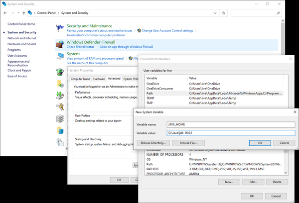

# Appendix A. Installing Kafka on Other Operating Systems

**←Back to [Table of Contents](../README.md)**

---

Apache Kafka is primarily a Java application and therefore should be able to run on any system where you are able to install a JRE. It has, however, been optimized for Linux-based operating systems, so that is where it will perform best. Running on other operating systems may result in bugs specific to the OS. For this reason, when using Kafka for development or test purposes on a common desktop OS, it is a good idea to consider running in a virtual machine that matches your eventual production environment.

## Table of Contents

1. [Installing on Windows](#installing-on-windows)
   - [Using Windows Subsystem for Linux](#using-windows-subsystem-for-linux)
   - [Using Native Java](#using-native-java)
2. [Installing on macOS](#installing-on-macos)
   - [Using Homebrew](#using-homebrew)
   - [Installing Manually](#installing-manually)
3. [External Resources](#external-resources)

---

## Installing on Windows

As of Microsoft Windows 10, there are now two ways that you can run Kafka. The traditional way is using a native Java installation. Windows 10 users also have the option to use the Windows Subsystem for Linux. The latter method is highly preferred because it provides a much simpler setup that more closely matches the typical production environment, so we will review it first.

### Using Windows Subsystem for Linux

If you are running Windows 10, you can install native Ubuntu support under Windows using Windows Subsystem for Linux (WSL). At the time of publication, Microsoft still considers WSL to be an experimental feature. Though it acts similar to a virtual machine, it does not require the resources of a full VM and provides richer integration with the Windows OS.

To install WSL, follow the instructions available from the Microsoft Developer Network at the **"What Is the Windows Subsystem for Linux?"** page. Once that is done, you will need to install a JDK using `apt` (assuming that you have installed the Ubuntu system package for WSL):

```bash
$ sudo apt install openjdk-16-jre-headless
[sudo] password for username:
Reading package lists... Done
Building dependency tree
Reading state information... Done
[...]
done.
$
```

Once you have installed the JDK, you can proceed to install Apache Kafka using the instructions in Chapter 2.

### Using Native Java

For older versions of Windows, or if you prefer not to use the WSL environment, you can run Kafka natively with a Java environment for Windows. Be aware, however, that this can introduce bugs specific to the Windows environment. These bugs may not get the attention in the Apache Kafka development community as similar problems on Linux might.

Before installing ZooKeeper and Kafka, you must have a Java environment set up. You should install the latest version of Oracle Java 16, which can be found on the Oracle Java SE download page. Download a full JDK package so that you have all the Java tools available, and follow the instructions for installation.

#### BE CAREFUL WITH PATHS

When installing Java and Kafka, it is highly recommended that you stick to installation paths that do not contain spaces. While Windows allows spaces in paths, applications that are designed to run in Unix environments are not set up this way, and specifying paths will be difficult. When installing Java, make sure to set the installation path with this in mind. For example, if installing JDK 16.0.1, a good choice would be to use the path `C:\Java\jdk-16.0.1`.

Once Java is installed, set up the environment variables so that it can be used. This is done in the Control Panel for Windows, though the exact location will depend on your version of the OS. In Windows 10, you must:

1. Select **"System and Security"**
2. Select **System**
3. Select **"Advanced system settings,"** which will open the System Properties window
4. On the Advanced tab, click the **"Environment Variables"** button

Use this section to add a new user variable named `JAVA_HOME` (Figure A-1) and set it to the path where you installed Java. Then edit the system variable named `Path` and add a new entry that is **`%JAVA_HOME%\bin`**. Save these settings, and exit out of the Control Panel.



**Figure A-1.** Adding the `JAVA_HOME` variable

Now you can proceed to install Apache Kafka. The installation includes ZooKeeper, so you do not have to install it separately. The current release of Kafka can be downloaded online. At publication time, that version is 2.8.0 running under Scala version 2.13.0. The downloaded file will be gzip compressed and packaged with the `tar` utility, so you will need to use a Windows application such as 8 Zip to uncompress it. Similar to installing on Linux, you must choose a directory to extract Kafka into. For this example, we will assume Kafka is extracted into `C:\kafka_2.13-2.8.0`.

Running ZooKeeper and Kafka under Windows is a little different, as you must use the batch files designed for Windows rather than the shell scripts for other platforms. These batch files also do not support backgrounding the application, so you will need a separate shell for each application. First, start ZooKeeper:

```powershell
PS C:\> cd kafka_2.13-2.8.0
PS C:\kafka_2.13-2.8.0> bin\windows\zookeeper-server-start.bat C:\kafka_2.13-2.8.0\config\zookeeper.properties
[2021-07-18 17:37:12,917] INFO Reading configuration from: C:\kafka_2.13-2.8.0\config\zookeeper.properties (org.apache.zookeeper.server.quorum.QuorumPeerConfig)
[...]
[2021-07-18 17:37:13,135] INFO PrepRequestProcessor (sid:0) started, reconfigEnabled=false (org.apache.zookeeper.server.PrepRequestProcessor)
[2021-07-18 17:37:13,144] INFO Using checkIntervalMs=60000 maxPerMinute=10000 (org.apache.zookeeper.server.ContainerManager)
```

Once ZooKeeper is running, you can open another window to start Kafka:

```powershell
PS C:\> cd kafka_2.13-2.8.0
PS C:\kafka_2.13-2.8.0> .\bin\windows\kafka-server-start.bat C:\kafka_2.13-2.8.0\config\server.properties
[2021-07-18 17:39:46,098] INFO Registered kafka:type=kafka.Log4jController MBean (kafka.utils.Log4jControllerRegistration$)
[...]
[2021-07-18 17:39:47,918] INFO [KafkaServer id=0] started (kafka.server.KafkaServer)
[2021-07-18 17:39:48,009] INFO [broker-0-to-controller-send-thread]: Recorded new controller, from now on will use broker 192.168.0.2:9092 (id: 0 rack: null) (kafka.server.BrokerToControllerRequestThread)
```

## Installing on macOS

macOS runs on Darwin, a Unix OS that is derived, in part, from FreeBSD. This means that many of the expectations of running on a Unix OS hold true, and installing applications designed for Unix, like Apache Kafka, is not too difficult. You can either keep the installation simple by using a package manager (like Homebrew), or you can install Java and Kafka manually for greater control over versions.

### Using Homebrew

If you have already installed Homebrew for macOS, you can use it to install Kafka in one step. This will ensure that you have Java installed first, and it will then install Apache Kafka 2.8.0 (as of the time of writing).

If you have not yet installed Homebrew, do that first by following the directions on the installation page. Then you can install Kafka itself. The Homebrew package manager will ensure that you have all the dependencies installed first, including Java:

```bash
$ brew install kafka
==> Installing dependencies for kafka: openjdk, openssl@1.1 and zookeeper
==> Installing kafka dependency: openjdk
==> Pouring openjdk--16.0.1.big_sur.bottle.tar.gz
[...]
==> Summary
/usr/local/Cellar/kafka/2.8.0: 200 files, 68.2MB
$
```

Homebrew will install Kafka under `/usr/local/Cellar`, but the files will be linked into other directories:

- Binaries and scripts will be in `/usr/local/bin`.
- Kafka configurations will be in `/usr/local/etc/kafka`.
- ZooKeeper configurations will be in `/usr/local/etc/zookeeper`.
- The `log.dirs` configuration (the location for Kafka data) will be set to `/usr/local/var/lib/kafka-logs`.

After installation is complete, you can start ZooKeeper and Kafka (this example starts Kafka in the foreground):

```bash
$ /usr/local/bin/zkServer start
ZooKeeper JMX enabled by default
Using config: /usr/local/etc/zookeeper/zoo.cfg
Starting zookeeper ... STARTED
$ /usr/local/bin/kafka-server-start /usr/local/etc/kafka/server.properties
[2021-07-18 17:52:15,688] INFO Registered kafka:type=kafka.Log4jController MBean (kafka.utils.Log4jControllerRegistration$)
[...]
[2021-07-18 17:52:18,187] INFO [KafkaServer id=0] started (kafka.server.KafkaServer)
[2021-07-18 17:52:18,232] INFO [broker-0-to-controller-send-thread]: Recorded new controller, from now on will use broker 192.168.0.2:9092 (id: 0 rack: null) (kafka.server.BrokerToControllerRequestThread)
```

### Installing Manually

Similar to a manual installation for the Windows OS, when installing Kafka on macOS, you must first install a JDK. Use the same Oracle Java SE download page to get the proper version for macOS. You can then download Apache Kafka, similar to Windows again. For this example, we will assume that the Kafka download is expanded into the `/usr/local/kafka_2.13-2.8.0` directory.

Starting ZooKeeper and Kafka looks just like starting them when using Linux, though you will need to make sure your `JAVA_HOME` directory is set first:

```bash
$ export JAVA_HOME=`/usr/libexec/java_home -v 16.0.1`
$ echo $JAVA_HOME
/Library/Java/JavaVirtualMachines/jdk-16.0.1.jdk/Contents/Home
$ /usr/local/kafka_2.13-2.8.0/bin/zookeeper-server-start.sh -daemon /usr/local/kafka_2.13-2.8.0/config/zookeeper.properties
$ /usr/local/kafka_2.13-2.8.0/bin/kafka-server-start.sh /usr/local/kafka_2.13-2.8.0/config/server.properties
[2021-07-18 18:02:34,724] INFO Registered kafka:type=kafka.Log4jController MBean (kafka.utils.Log4jControllerRegistration$)
[...]
[2021-07-18 18:02:36,873] INFO [KafkaServer id=0] started (kafka.server.KafkaServer)
[2021-07-18 18:02:36,915] INFO [broker-0-to-controller-send-thread]: Recorded new controller, from now on will use broker 192.168.0.2:9092 (id: 0 rack: null) (kafka.server.BrokerToControllerRequestThread)
```

## External Resources

- [What Is the Windows Subsystem for Linux?](https://oreil.ly/dULqm)
- [Oracle Java SE Download Page](https://jdk.java.net/)
- [Kafka Current Release](https://oreil.ly/xpwY1)
- [Homebrew for macOS](https://brew.sh/)
- [Homebrew Installation Page](https://oreil.ly/ZVEvc)
